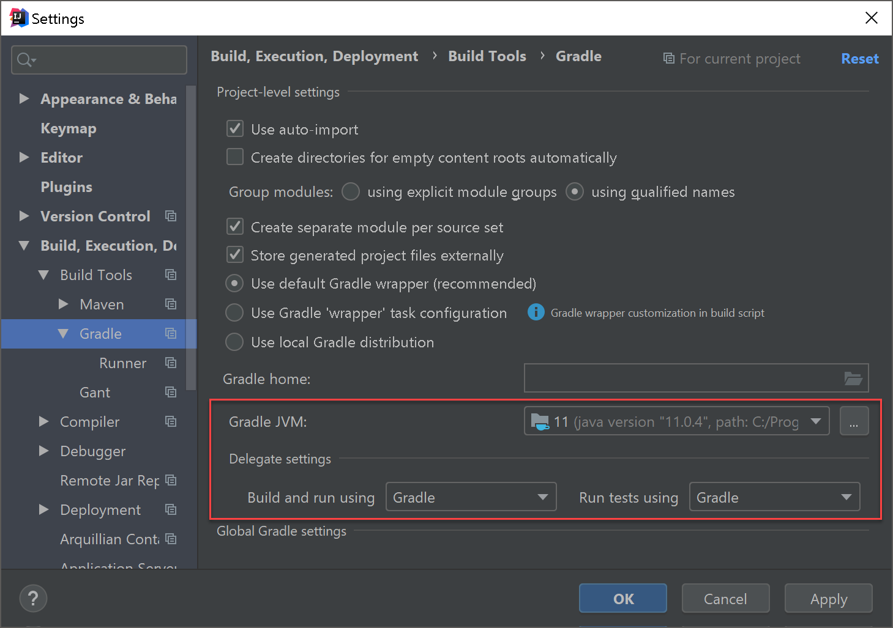
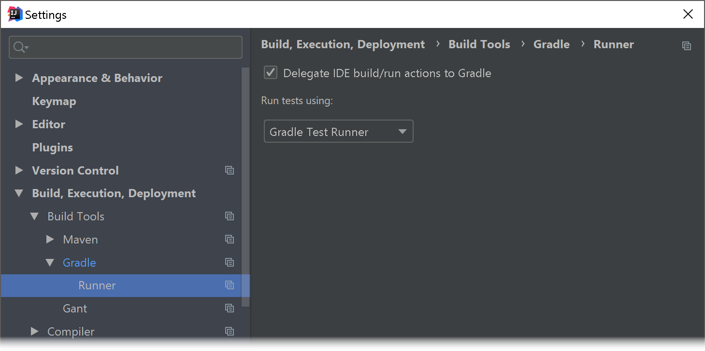
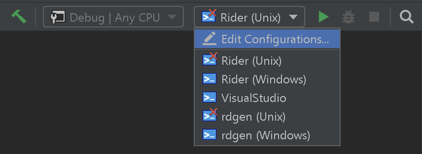

[![JetBrains Official](https://img.shields.io/badge/project-official-brightgreen.svg?style=flat-square&label=&colorA=3c3c3c&colorB=ff8a2c&logo=data%3Aimage%2Fsvg%2Bxml%3Bbase64%2CPD94bWwgdmVyc2lvbj0iMS4wIiBlbmNvZGluZz0idXRmLTgiPz48c3ZnIHZlcnNpb249IjEuMSIgaWQ9IkxheWVyXzEiIHhtbG5zPSJodHRwOi8vd3d3LnczLm9yZy8yMDAwL3N2ZyIgeG1sbnM6eGxpbms9Imh0dHA6Ly93d3cudzMub3JnLzE5OTkveGxpbmsiIHg9IjBweCIgeT0iMHB4IiB3aWR0aD0iMTRweCIgaGVpZ2h0PSIxNHB4IiB2aWV3Qm94PSIwIDAgMTQgMTQiIGVuYWJsZS1iYWNrZ3JvdW5kPSJuZXcgMCAwIDE0IDE0IiB4bWw6c3BhY2U9InByZXNlcnZlIj48cmVjdCB4PSIxIiB5PSIxMiIgZmlsbD0iI0ZGRkZGRiIgd2lkdGg9IjciIGhlaWdodD0iMSIvPjxwYXRoIGZpbGw9IiNGRkZGRkYiIGQ9Ik0wLjMsNy4zbDEtMS4xYzAuNCwwLjUsMC44LDAuNywxLjMsMC43YzAuNiwwLDEtMC40LDEtMS4yVjFoMS42djQuN2MwLDAuOS0wLjIsMS41LTAuNywxLjlDNC4xLDguMSwzLjQsOC40LDIuNiw4LjRDMS41LDguNCwwLjgsNy45LDAuMyw3LjN6Ii8%2BPHBhdGggZmlsbD0iI0ZGRkZGRiIgZD0iTTYuOCwxaDMuNGMwLjgsMCwxLjUsMC4yLDEuOSwwLjZjMC4zLDAuMywwLjUsMC43LDAuNSwxLjJsMCwwYzAsMC44LTAuNCwxLjMtMSwxLjZDMTIuNSw0LjgsMTMsNS4zLDEzLDYuMmwwLDBjMCwxLjMtMS4xLDItMi43LDJINi44VjF6IE0xMSwzLjFjMC0wLjUtMC40LTAuNy0xLTAuN0g4LjR2MS41aDEuNUMxMC42LDMuOSwxMSwzLjcsMTEsMy4xTDExLDMuMXogTTEwLjIsNS4zSDguNHYxLjZoMS45YzAuNywwLDEuMS0wLjIsMS4xLTAuOGwwLDBDMTEuNCw1LjYsMTEuMSw1LjMsMTAuMiw1LjN6Ii8%2BPHJlY3QgeD0iMSIgeT0iMTIiIGZpbGw9IiNGRkZGRkYiIHdpZHRoPSI3IiBoZWlnaHQ9IjEiLz48L3N2Zz4%3D)](https://jetbrains.com/)

# Plugin Template for ReSharper and Rider

This repository defines a template for easy development of ReSharper and Rider plugins according to the official documentation for the [ReSharper SDK](https://www.jetbrains.com/help/resharper/sdk) and [IntelliJ SDK](http://www.jetbrains.org/intellij/sdk/docs/welcome.html).

## Getting Started

Download the `JetBrains.ReSharper.SamplePlugin.*.nupkg` template package from the [releases page](https://github.com/JetBrains/resharper-rider-plugin/releases) and invoke from the download directory:

```
dotnet new --install JetBrains.ReSharper.SamplePlugin.*.nupkg
```

Afterwards, a new project can be created from the installed template. The `name` identifier should be letters-only:

```
dotnet new resharper-rider-plugin --name MyAwesomePlugin [--resharper-only] [--build-only]
```

This will create a new folder with all the structure ready to go and all identifiers, like namespaces, ids and file names, replaced with `MyAwesomePlugin`. Passing `--resharper-only` will exclude all Rider related files. With the `--build-only --force`, all the build-relevant files can be updated (some reverts are most likely necessary). Metadata including project website, description, author and others should be entered in `Plugin.props` and `plugins.xml`.

> :warning: The only place that currently needs to be updated manually is the `RIDER_PLUGIN_ID` in `README.md`, which you'll only get after uploading your Rider plugin the first time.
> 

## Samples

This repository contains a few sample projects for various extension points:

- [Actions](samples/Actions)
- [Code Inspections](samples/CodeInspections)
- [Code Vision](samples/CodeVision)
- [Inlay Hints](samples/InlayHints)
- [Notifications](samples/Notifications)
- [Option Pages](samples/OptionPages)
- [Postfix Templates](samples/PostfixTemplates)
- [Rd Protocol](samples/RdProtocol)
- [Settings Provider](samples/SettingsProvider)

## Development

For general development, there are a couple of scripts/invocations worth knowing. Most importantly, to run and debug your plugin, invoke:

```
# For Rider
gradlew :runIde

# For ReSharper (VisualStudio)
powershell .\runVisualStudio.ps1
```

When starting Gradle tasks from inside IntelliJ IDEA, make sure that the Gradle settings are as follows:





If your Rider plugin requires a [model](https://www.jetbrains.com/help/resharper/sdk/Products/Rider.html) to share information between ReSharper backend and IntelliJ frontend, there is a sample protocol defined in `protocol` directory. To generate the Kotlin and C# implementation, call:

```
gradlew :rdgen
```

Opening the solution in Rider or IntelliJ IDEA will automatically provide the corresponding [run configurations](https://www.jetbrains.com/help/rider/Creating_and_Editing_Run_Debug_Configurations.html):



### Version Relevant Code

There are a couple of version identifiers that should always be updated synchronously:

- The `ProductVersion` variable in [build.gradle](https://github.com/JetBrains/resharper-rider-plugin/blob/master/content/gradle.properties#L17) is responsible for download a certain Rider frontend distribution
- The `SdkVersion` property in [Plugin.props](https://github.com/JetBrains/resharper-rider-plugin/blob/master/content/src/dotnet/Plugin.props#L4) will affect the referenced `JetBrains.ReSharper.SDK` NuGet package and will also determine the `wave` version that is required for the Extension Manager in ReSharper
- The `runVisualStudio.ps1` script will always download the latest available installer for ReSharper - this can be either a normal release or early-access-program (EAP) release

Available versions are listed here for [ReSharper](https://www.nuget.org/packages/JetBrains.ReSharper.SDK) and [Rider](https://www.jetbrains.com/intellij-repository/snapshots) (under `com.jetbrains.intellij.rider`).

### Visual Studio / ReSharper Relevant Directories

Installing ReSharper and the plugin into an experimental Visual Studio instance (hive) affects the following directories:

- `%LOCALAPPDATA%/JetBrains/plugins` contains a copy of the plugin package, similar to the global NuGet package cache
- `%LOCALAPPDATA%/JetBrains/Installations` contains settings directories per experimental instance, whereas `packages.config` defines what plugins should be installed
- `%APPDATA%/JetBrains/ReSharperPlatformVs[version]` contains binary directories per experimental instance with all assemblies to run ReSharper and the plugin

Using [attached folders](https://www.jetbrains.com/help/rider/Extending_Your_Solution.html#adding-external-files-and-folders) can be of great help to track these directories while developing a ReSharper plugin. 

## Deployment

Both plugins can be published by calling:

```
# For Rider & ReSharper (Gradle)
gradlew :publishPlugin -PPluginVersion=<version> -PPublishToken=<token>

# For ReSharper (PowerShell)
powershell ./publishPlugin.ps1 -Version <version> -ApiKey <ApiKey>
```

> :warning: The first deployment must be done through the [marketplace](https://plugins.jetbrains.com/).
