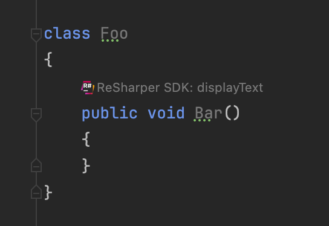

This sample shows how [Inlay Hints](https://www.jetbrains.com/help/rider/Inline_Parameter_Name_Hints.html) are implemented.

# Relevant Files

- [SampleCodeInsightsElementAnalyzer.cs](src/dotnet/ReSharperPlugin.CodeVision/SampleCodeInsightsElementAnalyzer.cs)
- [SampleCodeInsightsProvider.cs](src/dotnet/ReSharperPlugin.CodeVision/SampleCodeInsightsProvider.cs)
