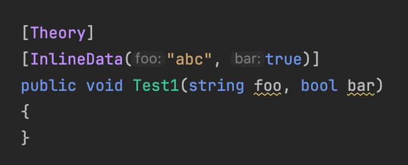

This sample shows how [Inlay Hints](https://www.jetbrains.com/help/rider/Inline_Parameter_Name_Hints.html) are implemented.

# Relevant Files

- [SampleAdornmentDataModel.cs](src/dotnet/ReSharperPlugin.InlayHints/SampleAdornmentDataModel.cs)
- [SampleHintElementAnalyzer.cs](src/dotnet/ReSharperPlugin.InlayHints/SampleHintElementAnalyzer.cs)
- [SampleInlayHint.cs](src/dotnet/ReSharperPlugin.InlayHints/SampleInlayHint.cs)
- [SampleInlayHintBase.cs](src/dotnet/ReSharperPlugin.InlayHints/SampleInlayHintBase.cs)
