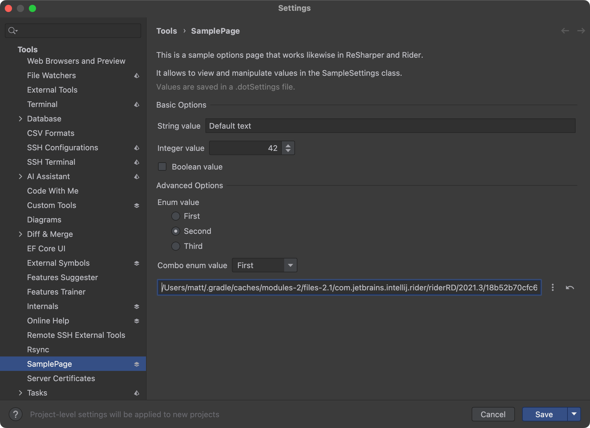

This sample shows how [Option Pages](https://www.jetbrains.com/help/rider/Rider_Settings.html) are implemented.

# Relevant Files

- [SamplePage.cs](src/dotnet/ReSharperPlugin.OptionPages/SamplePage.cs)
- [SampleSettings.cs](src/dotnet/ReSharperPlugin.OptionPages/SampleSettings.cs)
- [SamplePage.kt](src/rider/main/kotlin/com/jetbrains/rider/plugins/samples/options/SamplePage.kt)
- [OptionPagesBundle.kt](src/rider/main/kotlin/com/jetbrains/rider/plugins/samples/OptionPagesBundle.kt)
- [OptionPagesBundle.properties](src/rider/main/resources/messages/OptionPagesBundle.properties)
- [plugin.xml](src/rider/main/resources/META-INF/plugin.xml)
